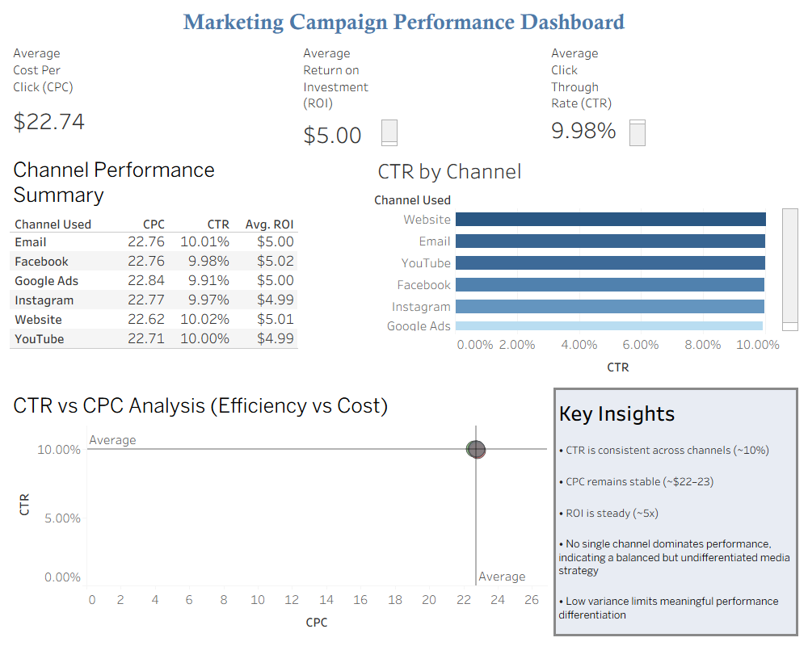

# 📊 Customer Segmentation Analysis

## 📌 Project Overview
This project focuses on analyzing customer data to identify distinct segments based on behavior and engagement patterns.

---

## 🎯 Objectives
- Segment customers based on key attributes
- Identify high-value customer groups
- Analyze engagement and conversion trends
- Support targeted marketing strategies

---

## 🛠️ Tools Used
- SQL Server (SSMS)
- Tableau
- Excel / CSV Dataset

---

## 📂 Dataset
The dataset includes customer demographics, transaction behavior, and engagement metrics.

---

## 📊 Dashboard Features
- Customer segment distribution
- Engagement comparison across segments
- Revenue contribution analysis
- KPI indicators for performance

---

## 📈 Key Insights
- High-value customers contribute majority of revenue
- Certain segments show higher engagement rates
- Opportunity exists to target low-performing segments

---

## 🧠 Conclusion
Customer segmentation enables more targeted marketing strategies and improves overall campaign efficiency.

---

## 🖼️ Dashboard Preview

---

## 👤 Author
Varun Shaw
